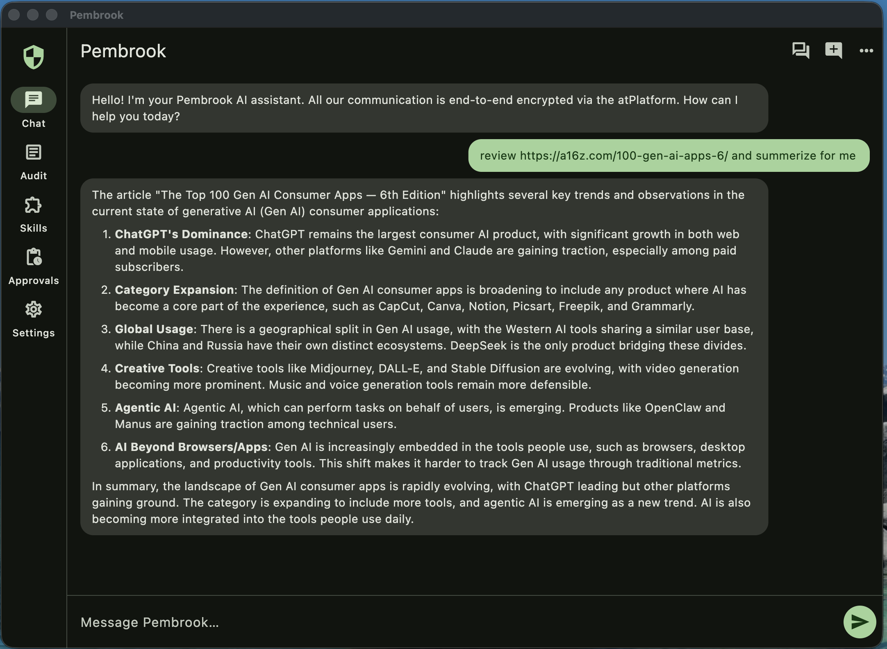
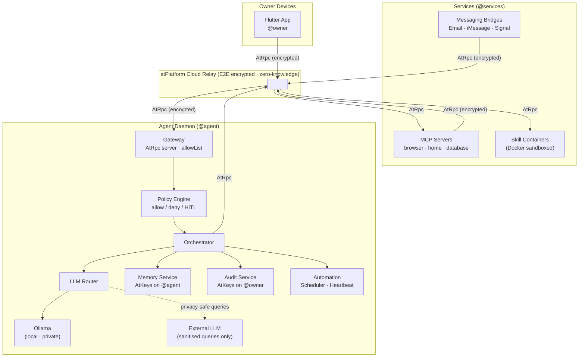

# Pembrook — Secure AI Agent Platform

A privacy-first, zero-trust AI agent built on the [atPlatform](https://docs.atsign.com/core). Pembrook eliminates the entire class of network-exposure and supply-chain vulnerabilities that plagued OpenClaw, replacing them with cryptographic identity, E2E encryption, and skill sandboxing — all with **zero open inbound ports** on any component.

See [ATPLATFORM_GUIDELINES.md](ATPLATFORM_GUIDELINES.md) for the complete atPlatform SDK reference.  
See [docs/ARCHITECTURE.md](docs/ARCHITECTURE.md) for internal design, data-flow, component contracts, and implementation decisions.  
See [GETTING_STARTED.md](GETTING_STARTED.md) for full setup instructions including chat history, skills, MCP servers, and bridges.  
See [PHASES.md](PHASES.md) for detailed per-phase implementation status.

---

## Screenshot



---

## Key Features

- **Real-time Progress Indicators** — See live status updates during multi-step tasks (e.g., "🌐 Fetching content from BBC...", "📧 Sending email...")
- **Smart Timeout Management** — 90-second timeout resets automatically with each progress update or content chunk
- **Multi-Device Sync** — Conversations sync across all your devices in real-time via encrypted AtKeys
- **Tool Call Streaming** — Watch the agent's reasoning and tool invocations as they happen
- **Urgency-Based Notifications** — Agent can send immediate alerts (critical/high) or queue low-priority updates for daily digest
- **MCP Integration** — Built-in browser automation, with extensibility for home control, databases, and more
- **Encrypted Audit Logs** — Immutable audit trail stored on your atServer, viewable in the app
- **Live Log Viewer** — Web-based development tool at `http://localhost:9090` with service filtering and keyword highlighting
- **Zero Trust Architecture** — No open ports, cryptographic authentication, E2E encryption on all channels

---

## Security at a Glance

| Threat | OpenClaw | Pembrook |
|---|---|---|
| Network exposure | Port 18789 open to internet (30,000+ exposed) | **Zero open ports** — all outbound-only |
| Authentication | None by default | Cryptographic atSign PKAM verification |
| Credentials | Plaintext `.env` files | Encrypted AtKeys, never plaintext |
| Skills/plugins | ClawHub (386 malicious packages in days) | Verified developer atSign + Docker sandbox |
| Prompt injection | Full agent authority | Untrusted input tagged, restricted context |
| Memory poisoning | All inputs equal authority | Source-tagged trust levels, non-escalatable |
| Confused deputy | Agent tricked into misusing tools | Context-aware tool filter per task type |
| Supply chain | Anonymous publishing | Developer identity required, signed packages |
| Lateral movement | Full home directory access | Pico-segmented per-skill / per-tool |
| Audit | None | Immutable AtKeys on owner's atServer |

---

## Architecture Overview



All connections are **outbound-only** to the atPlatform. No component has any open inbound port.

---

## Repository Layout

```
pembrook/
├── ATPLATFORM_GUIDELINES.md   # atPlatform SDK reference (do not add project specifics here)
├── README.md                  # This file — project documentation
├── agent/                     # Dart CLI — the AI agent daemon
│   ├── pubspec.yaml
│   ├── bin/main.dart          # Entry point: CLIBase auth → start Gateway
│   └── lib/
│       ├── core/              # Orchestrator, PolicyEngine, HitlManager
│       ├── services/          # LlmRouter, Sanitizer, MemoryService, AuditService
│       ├── gateway/           # AtRpc server (Gateway + Callbacks)
│       ├── skills/            # SkillRegistry, SandboxManager, SkillRunner
│       ├── mcp/               # SecureMcpClient
│       ├── automation/        # Scheduler, Heartbeat, NotificationManager
│       └── models/            # Policy, Conversation, AuditEntry, SkillMetadata, Task
├── app/                       # Flutter cross-platform UI (macOS, Android, Linux, Windows)
│   ├── pubspec.yaml
│   ├── android/               # Android-specific configuration (API 24+)
│   ├── macos/                 # macOS-specific configuration
│   ├── linux/                 # Linux-specific configuration
│   ├── windows/               # Windows-specific configuration
│   └── lib/
│       ├── auth/              # AuthScreen + all 4 auth workflows
│       ├── chat/              # ChatScreen + real-time streaming + multi-device sync
│       ├── settings/          # LLM settings, atSign management, font scale
│       ├── policy/            # YAML policy editor
│       ├── skills/            # Skill browser + install/configure/remove
│       ├── audit/             # Audit log viewer
│       ├── hitl/              # HITL approval dialogs
│       └── services/          # RpcService, DataService (ConversationStore)
├── bridge/                    # Messaging bridge agents (Phase 6) — share @services
├── mcp_servers/               # MCP server wrappers (Phase 4) — share @services
│   ├── home/                  # Home Automation
│   ├── database/              # Database
│   └── browser/               # Web Browser
├── skills/                    # Built-in skill packages (Phase 3) — share @services
│   ├── calendar/              # Google Calendar via CalDAV
│   ├── email/                 # SMTP send + IMAP read/delete  ← implemented
│   └── web_search/            # SearXNG / Brave Search
├── tools/                     # Development tools
│   └── log_viewer/            # Web-based log viewer (http://localhost:9090)
│       ├── server.py          # Python SSE server
│       ├── index.html         # Frontend with service filtering
│       └── Dockerfile         # Containerized version
├── docker-compose.yml         # Starts agent + Ollama + MCP servers + log viewer
├── docker-compose.gpu.yml     # GPU overlay (Linux + NVIDIA)
├── Dockerfile.agent           # Compiles and packages the agent (gosu entrypoint)
└── entrypoint-agent.sh        # chgrp docker.sock then exec gosu pembrook
```

---

## atSign Provisioning Map

Register all atSigns at [my.atsign.com](https://my.atsign.com) before first run.

**Minimum required atSigns: 3**

| atSign | Role | Notes |
|---|---|---|
| `@owner` | Human owner — primary identity | Used by the Flutter app on all your devices |
| `@agent` | AI agent daemon | Runs in Docker; stores skills, memory, audit logs |
| `@services` | Shared services identity | Used by ALL bridges, ALL MCP servers, AND all skill containers |

> A single `@services` atSign is sufficient for every service component (bridges, MCP servers, skills). There is no need to provision a separate atSign per bridge or per skill. The `@agent` allowList contains `@owner` and `@services`.

Advanced operators may provision individual atSigns per bridge or per skill for stricter isolation, but this is entirely optional.

---

## Namespace

All application data uses namespace **`pembrook`**.

Key format: `keyname.pembrook@atsign`

---

## AtKey Naming Conventions

| Key Pattern | Owner atServer | Purpose | TTL |
|---|---|---|---|
| `conversation_history.pembrook@owner` | `@owner` | **Cross-device sync** — full chat history list | — |
| `conversation_history_deleted.pembrook@owner` | `@owner` | **Tombstones** — deleted conversation IDs | — |
| `pembrook.conversation_sync.$ts.pembrook@owner` | Shared with `@owner` | **Sync trigger** — instant cross-device reload | 10s |
| `conversation.$convId.pembrook@owner` | `@owner` | Individual chat exchange (app) | 90 days |
| `conversation.$convId.pembrook@agent` | `@agent` | Agent-side conversation | 90 days |
| `context.user_preferences.pembrook@agent` | `@agent` | Owner preferences | — |
| `context.user_profile.pembrook@agent` | `@agent` | Personal info | — |
| `settings.llm.pembrook@agent` | `@agent` | LLM config (model, threshold) | — |
| `settings.app.pembrook@owner` | `@owner` | App UI preferences (synced) | — |
| `settings.heartbeat.pembrook@agent` | `@agent` | Heartbeat cadence | — |
| `policy.$policyId.pembrook@agent` | `@agent` | Policy rules (YAML) | — |
| `skill_index.pembrook@agent` | `@agent` | JSON list of installed skill IDs | — |
| `skill_meta.$skillId.pembrook@agent` | `@agent` | Installed skill metadata | — |
| `skill_state.$skillId.pembrook@agent` | `@agent` | Per-skill persistent state | — |
| `schedule.$taskId.pembrook@agent` | `@agent` | Scheduled task definition | — |
| `task.$taskId.pembrook@agent` | `@agent` | Active task state | — |
| `audit.$ts.$actionId.pembrook@owner` | `@owner` | **Immutable** audit log | — |
| `hitl.pending.$actionId.pembrook@agent` | `@agent` | Pending HITL approval | 5 min |
| `apikey.$provider.pembrook@agent` | `@agent` | Encrypted external API keys | — |
| `email.draft.$draftId.pembrook@agent` | `@agent` | Email drafts awaiting HITL | 7 days |
| `calendar.$eventId.pembrook@owner` | `@owner` | Calendar entries | — |
| `summary.$period.pembrook@agent` | `@agent` | Compressed conversation summaries | — |
| `digest.$date.pembrook@owner` | `@owner` | Daily notification digest | 30 days |
| `notify.{urgency}.{ts}.pembrook@agent` | Shared with `@owner` | Immediate alerts (critical/high) | 3-7 days |
| `notify.digest.$date.pembrook@agent` | Shared with `@owner` | Daily digest notification | 24 hours |

> `conversation_history.pembrook@owner` is a self-key on `@owner`'s atServer. All authenticated devices for an owner load this key to display conversation history. When any device modifies conversations (add/delete), it writes both `conversation_history` and `conversation_history_deleted` (tombstones) AtKeys, then sends a `pembrook.conversation_sync` notification to itself. All devices subscribe to this notification pattern and instantly reload when they receive it, ensuring cross-device sync happens within 1-2 seconds.
> Tombstones prevent deleted conversations from reappearing: when Device A deletes a conversation, the ID is added to `conversation_history_deleted`. Device B loads tombstones first, then filters them out when loading the conversation list.
> Audit keys use `Metadata()..immutable = true` — once written, they cannot be modified.  
> Audit keys are stored on `@owner`'s atServer so the agent cannot delete its own logs.

---

## AtRpc Message Formats

### Flutter App → Agent (chat command)

```json
{
  "command": "What's on my calendar tomorrow?",
  "conversationId": "conv-uuid-1234",
  "timestamp": 1741824000000
}
```

### Agent → Flutter App (streaming response chunk)

```json
{
  "conversationId": "conv-uuid-1234",
  "chunk": "You have a team standup at 9am...",
  "type": "content",
  "done": false,
  "chunkIndex": 3
}
```

### Agent → Flutter App (progress update)

Sent during multi-step tasks to show tool execution status:

```json
{
  "conversationId": "conv-uuid-1234",
  "chunk": "🌐 Fetching content from BBC News...",
  "type": "progress",
  "done": false,
  "chunkIndex": 2
}
```

Progress messages appear as ephemeral status indicators in the UI and reset the smart timeout counter.

### Agent → Flutter App (stream-end sentinel)

Sent once, after all content chunks have been flushed. Every authenticated device receives this notification via atPlatform broadcast, enabling cross-device sync.

```json
{
  "conversationId": "conv-uuid-1234",
  "chunk": "",
  "done": true,
  "chunkIndex": 12
}
```

### Agent → Flutter App (notification / alert)

The agent can send out-of-band notifications via the `notify_owner` tool. Urgency levels determine delivery:

- **critical/high** → Immediate notification (sent right away)
- **medium/low** → Queued for daily digest (batched and sent once per day)

Immediate notification:

```json
{
  "alertId": "push_1710000000123",
  "title": "Agent",
  "message": "Your scheduled backup completed successfully",
  "urgency": "high",
  "createdAt": 1710000000123
}
```

AtKey pattern: `pembrook.notify.{urgency}.{timestamp}.pembrook@agent` shared with `@owner`

Daily digest (sent once per day):

```json
{
  "date": "2026-03-19",
  "count": 5,
  "alerts": [
    {
      "alertId": "digest_001",
      "title": "Task Complete",
      "message": "Weekly report generated",
      "urgency": "low",
      "createdAt": 1710000000000
    }
  ]
}
```

AtKey pattern: `digest.{YYYY-MM-DD}.pembrook@agent` shared with `@owner`

**Note:** Flutter app subscription to `pembrook\.notify\..*` is not yet implemented. The notification system works on the agent side but requires app UI integration to display alerts.

### Messaging Bridge → Agent (inbound message)

```json
{
  "text": "Remind me about the meeting at 3pm",
  "senderAtSign": "@owner",
  "platform": "whatsapp",
  "timestamp": 1741824000000,
  "messageType": "text"
}
```

### Policy Engine → HITL Manager (approval request)

```json
{
  "actionId": "action-uuid-5678",
  "action": "send_email",
  "context": "Sending email to bob@example.com with subject 'Q1 Report'",
  "riskAssessment": "Outbound communication — HITL required by policy",
  "options": ["approve", "deny"],
  "timeoutSeconds": 300
}
```

### Audit Entry (stored as immutable AtKey on @owner)

```json
{
  "timestamp": 1741824000000,
  "actionType": "skill_invocation",
  "initiatorAtSign": "@owner",
  "targetResource": "email.draft.abc123",
  "policyDecision": "escalate_hitl",
  "inputHash": "sha256:abc...",
  "outputHash": "sha256:def...",
  "executionDurationMs": 1200,
  "skillId": "email_skill",
  "mcpServer": null
}
```

---

## Data Flow: Interactive Chat

```
Owner types → Flutter app
  → AtRpcClient.call({command, conversationId}) → atPlatform
    → Gateway.handleRequest() — verifies sender in allowList
      → PolicyEngine.checkPolicy() — identity + capability + temporal check
        → Orchestrator.processRequest()
          → MemoryService.loadConversation() — AtKey get()
          → LlmRouter.generateResponse() — Ollama streaming (tool-aware)
              [Progress indicators sent for each tool call, e.g.:]
              → "🌐 Fetching content from CNN..." (type: 'progress')
              → "📧 Sending email to recipient..." (type: 'progress')
              Content chunks batched at ~80 chars, sent as AtRpc notifications
              → all @owner devices receive live tokens + progress updates
              → Smart timeout (90s) resets on each chunk or progress event
          → [tool calls, up to maxIterations=10]
              → SkillRunner / PolicyEngine / HitlManager
              → result appended; original task re-injected; loop continues
          → After all chunks flushed:
              → done:true sentinel sent → all @owner devices notified
              → 2-second grace period for late-arriving chunks
          → ConversationStore.save() — writes conversation_history AtKey
          → AuditService.log() — immutable AtKey on @owner
```

## Data Flow: Multi-Device Sync

```
Device A sends chat → agent responds → done:true sentinel broadcast
  → Device B (same @owner, different device):
      Receives all streaming chunks (displayed if screen is idle)
      Receives done:true notification
        → RpcService fires conversationCompletedEvents stream
          → ChatScreen._convCompletedSub triggers (3s delay for AtKey propagation)
            → ConversationStore.load() re-reads conversation_history AtKey
            → If Device B was idle: auto-switches to show completed exchange
            → If Device B was active in another chat: SnackBar with [View] button

Device A deletes conversation(s):
  → ConversationStore.delete() or .deleteMany()
    → Adds IDs to tombstone set (_deletedIds)
    → Writes conversation_history_deleted.pembrook@owner AtKey
    → Writes conversation_history.pembrook@owner AtKey
    → Sends pembrook.conversation_sync.<timestamp> notification to self
  → Device B receives sync notification (1-2 seconds)
    → ConversationStore.load() reloads both AtKeys
    → Tombstones filter out deleted conversations
    → UI updates automatically via notifyListeners()

Device A resumes from background:
  → WidgetsBindingObserver.didChangeAppLifecycleState(resumed)
    → ConversationStore.load() re-reads conversation_history AtKey
```

## Data Flow: Skill Invocation

```
Orchestrator identifies skill need
  → SkillRegistry.getSkill() — in-memory cache (loaded at startup via loadCache())
  → PolicyEngine.checkPolicy(skill capabilities)
    → If HITL required:
        → HitlManager.requestApproval() — notify @owner
          → Owner approves in Flutter app → AtRpc response
    → SandboxManager.executeInSandbox()
        → Docker via unix socket (/var/run/docker.sock)
          Network skills (email, calendar, web_search): --network=bridge
          All other skills:                             --network=none
          → --rm --memory=256m --cpus=0.5
          → Skill reads payload from stdin, writes JSON result to stdout
          → Container destroyed after execution
      → AuditService.log(sandbox events)
```

## Data Flow: Notifications & Alerts

```
LLM calls notify_owner tool (or scheduled task triggers NotificationManager)
  → NotificationManager.sendAlert(Alert)
    → Urgency routing:
        critical/high → _sendImmediate()
          → notificationService.notify(pembrook.notify.{urgency}.{ts}@agent → @owner)
          → TTL: critical=7d, high=3d
        medium/low → add to _digestQueue
          → HeartbeatEngine flushes daily (or on shutdown)
          → Single digest AtKey: digest.$date.pembrook@owner (TTL 30d)
          → One notification sent: pembrook.notify.digest.$date@agent → @owner
    → AuditService.log(notification events)

Owner's Flutter app (when implemented):
  → notificationService.subscribe(regex: 'pembrook\\.notify\\..*')
    → Display immediate alerts as push notifications
    → Daily digest shown as single notification with aggregated count
```

**Current Status:** Agent-side complete; Flutter app subscription pending implementation.

---

## Deployment

### Local (Docker Compose)

```bash
# 1. Provision 3 atSigns at my.atsign.com:
#      @owner   — your identity / Flutter app
#      @agent   — the AI daemon
#      @services — bridges, MCP servers, skills (one atSign for all)
#    Save the three .atKeys files to ~/.atsign/keys/

# 2. Configure the agent (run once, or when settings change):
dart run agent/bin/init_config.dart \
  --atsign @youragent \
  --key-file ~/.atsign/keys/@youragent_key.atKeys \
  --owner @you \
  --ollama-model qwen3.5:9b \
  --allowed-users @you

# 3. Pull the Ollama model:
docker compose run --rm ollama ollama pull qwen3.5:9b

# 4. Start (CPU — works on macOS, Windows, Linux):
docker compose up -d

# 4a. Start (GPU — Linux + NVIDIA only, requires nvidia-container-toolkit):
docker compose -f docker-compose.yml -f docker-compose.gpu.yml up -d

# Tail agent logs:
docker compose logs -f agent

# Or use the live log viewer (recommended for development):
# Open http://localhost:9090 in your browser
# - Filter by service (agent, mcp_*, ollama, skill_*, etc.)
# - Keyword highlighting for tool calls, errors, iterations
# - Tree-style display of nested JSON arguments
# - Auto-scrolling live stream
```

> **GPU setup (Linux + NVIDIA):** Install [nvidia-container-toolkit](https://docs.nvidia.com/datacenter/cloud-native/container-toolkit/install-guide.html), then run:
> ```bash
> sudo nvidia-ctk runtime configure --runtime=docker
> sudo systemctl restart docker
> ```
> Then use the `docker-compose.gpu.yml` override above. macOS and Windows use CPU mode automatically.

### Cloud VPS (zero open ports)

```bash
# Same as local — no security group inbound rules needed.
# SSH access: use NoPorts instead of opening port 22.

# CPU:
docker compose up -d

# GPU (if VPS has NVIDIA — see GPU setup note above):
docker compose -f docker-compose.yml -f docker-compose.gpu.yml up -d
```

### Verify zero open ports

```bash
nmap -p- localhost  # should show 0 open ports (Ollama binds loopback only)
```

---

## Implementation Phases

| Phase | Components | Status |
|---|---|---|
| **Phase 1** | Gateway + Orchestrator + Ollama + Flutter App | ✅ Complete |
| **Phase 2** | Memory Service + Audit + Policy Engine | ✅ Complete |
| **Phase 3** | Skill System + Sandbox + Email/Calendar/Search skills | 🚧 In Progress |
| **Phase 4** | MCP Integration + Home/DB/Browser MCP servers | ✅ Complete |
| **Phase 5** | Heartbeat + Scheduler + Notifications | ✅ Complete |
| **Phase 6** | Messaging Bridges (WhatsApp, Telegram, Discord, Slack) | 📋 Planned |

Phase 3 detail:

| Component | Status |
|---|---|
| SkillRegistry (AtKey CRUD + in-memory cache + `skill_index` key) | ✅ |
| SandboxManager (Docker via unix socket, gosu entrypoint) | ✅ |
| SkillRunner + PolicyEngine integration + HITL | ✅ |
| Email skill (`send_email`, `list_inbox`, `read_email`, `delete_email`) | ✅ |
| Calendar skill (CalDAV / Google Calendar) | 🚧 Stub |
| Web search skill (SearXNG / Brave) | 🚧 Stub |
| Multi-step tool chaining (`tool_call_id`, `maxIterations=10`, task anchoring) | ✅ |
| Multi-device sync (`conversation_history` AtKey + `done:true` sentinel) | ✅ |
| Real-time progress indicators (tool execution status with emoji icons) | ✅ |
| Smart timeout (90s with activity tracking, resets on progress/content) | ✅ |
| Late response preservation (2s grace period + buffer comparison) | ✅ |
| Live log viewer (port 9090, service filtering, keyword highlighting) | ✅ |
| Scheduled tasks (cron + one-shot, `schedule_task`, `cancel_task`, `list_tasks`) | ✅ |
| Heartbeat (60s tick, agent health check, memory summarization) | ✅ |
| NotificationManager (urgency-based alerts + daily digest) | ✅ |
| `notify_owner` tool (immediate out-of-band alerts from agent) | ✅ |

---

## Prerequisites

- [Dart SDK](https://dart.dev/get-dart) `>=3.6.0`
- [Flutter SDK](https://flutter.dev/docs/get-started/install)
- [Docker](https://docs.docker.com/get-docker/) (for Ollama and skill sandbox)
- [Ollama](https://ollama.ai) running locally: `docker run -d -p 127.0.0.1:11434:11434 ollama/ollama`
- atSigns provisioned at [my.atsign.com](https://my.atsign.com)

---

## Contributing

See [CONTRIBUTING.md](CONTRIBUTING.md).

## License

BSD 3-Clause — see [LICENSE](LICENSE).

## Maintainers

- [cconstab](https://github.com/cconstab)
